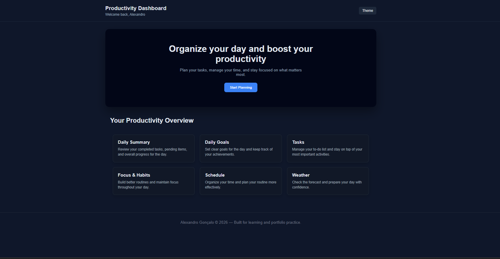
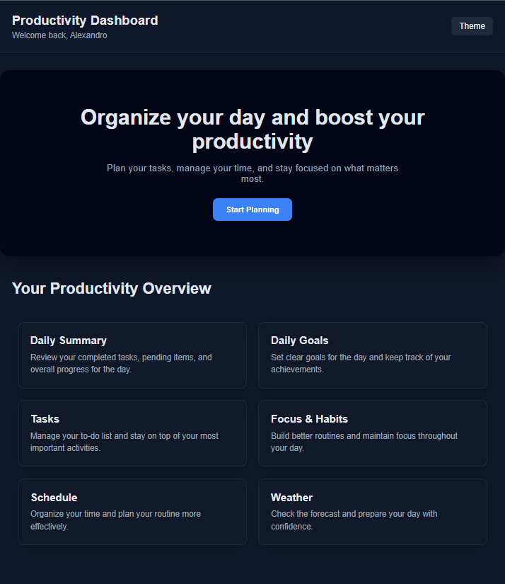
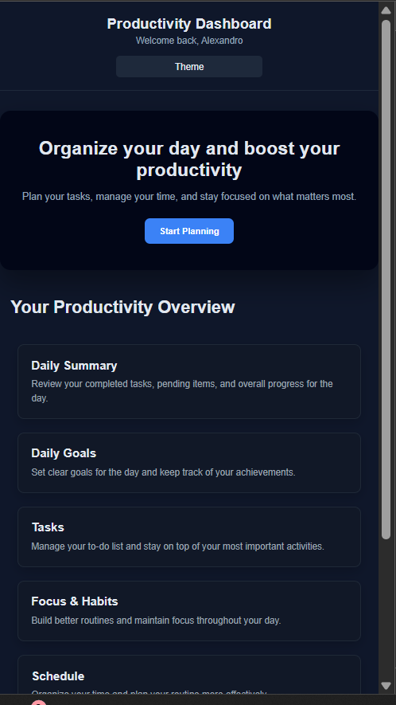

# Productivity Dashboard

A modern and responsive Productivity Dashboard interface built for learning and portfolio practice.

This project was developed to practice semantic HTML structure, CSS layout techniques, responsive design, and component organization.

---

## 🚀 Project Preview

The dashboard interface includes:

- Header with user greeting and theme button  
- Hero section with main productivity message  
- Overview cards displaying productivity features  
- Clean and modern dark UI design  
- Fully responsive layout for desktop, tablet, and mobile  

## 📸 Responsive Preview

### Desktop

### Tablet

### Mobile

---

## 🧠 Features

- Semantic HTML structure  
- CSS Flexbox for header layout  
- CSS Grid for card layout  
- Hover animations and visual feedback  
- Dark theme interface  
- Responsive breakpoints for tablet and mobile  
- Centered content container for professional layout  

---

## 📱 Responsive Behavior

The layout adapts automatically:

- **Desktop:** 3 cards per row  
- **Tablet:** 2 cards per row  
- **Mobile:** 1 card per row with stacked header layout  

---

## 🛠️ Technologies Used

- HTML5  
- CSS3  
- Flexbox  
- CSS Grid  
- Media Queries  

---

## 📂 Project Structure

---

## 🎯 Learning Goals

This project was created to practice:

- Clean layout structuring  
- Component thinking  
- Responsive design fundamentals  
- Professional UI spacing and hierarchy  
- Portfolio-ready project organization  

---

## 👨‍💻 Author

Developed by **Alexandro Gonçalo**  
Built for study, practice and portfolio development.

---

## ⭐ Future Improvements

- Add real task management functionality  
- Implement theme switch with JavaScript  
- Add animations and transitions  
- Integrate API data (weather, productivity stats)  
